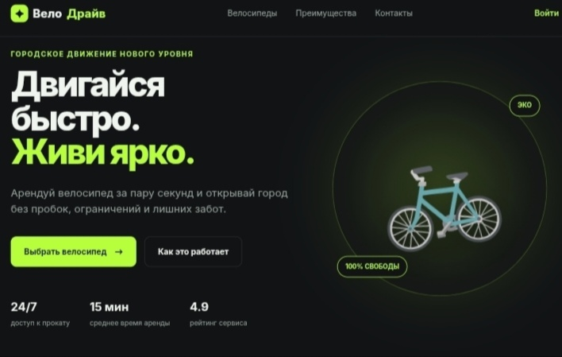

# 🚲 ВелоДрайв — прокат велосипедов

Одностраничный сайт сервиса по аренде велосипедов: адаптивная вёрстка, интерактивный расчёт стоимости, модальное окно подтверждения и карта станций на Leaflet.

## 🔗 Демо

**[Посмотреть на GitHub Pages](https://tbeerse.github.io/velodrive-rental/)**

## ✨ Возможности

- 🚲 Каталог велосипедов (городские, электро, горные)
- 🧮 Калькулятор стоимости аренды в реальном времени
- ➕ Дополнительные опции (шлем, детское кресло)
- 📅 Выбор даты и времени старта
- 🗺 Интерактивная карта станций проката (Leaflet + CARTO Dark Matter)
- 🪟 Модальное окно с деталями бронирования
- ♿ Доступность: focus trap, возврат фокуса, ARIA-атрибуты
- 📱 Полностью адаптивная вёрстка (mobile-first)
- 🌙 Тёмная тема по умолчанию

## 🛠 Технологии

- **HTML5** — семантическая вёрстка
- **CSS3** — Grid, Flexbox, переменные, media queries
- **JavaScript (ES Modules)** — чистый JS без фреймворков
- **Leaflet 1.9.4** — интерактивная карта
- **CARTO Dark Matter** — тайлы для тёмной карты
- **Google Fonts** — Inter

## 🚀 Установка и запуск

### Клонировать репозиторий

    git clone https://github.com/TbeerSe/velodrive-rental.git
    cd velodrive-rental

### Запустить локальный сервер

Для работы ES-модулей нужен HTTP-сервер (из-за политики безопасности браузера `file://` не подойдёт).

    python -m http.server 8000

или через Node.js:

    npx serve .

Затем открой http://localhost:8000 в браузере.

## 📁 Структура проекта

    velodrive-rental/
    ├── index.html
    ├── css/
    │   ├── base.css          # переменные, сброс, общие стили
    │   ├── header.css        # шапка и подвал
    │   ├── hero.css          # первый экран
    │   ├── bikes.css         # карточки велосипедов и форма брони
    │   ├── advantages.css    # преимущества и карта
    │   ├── modal.css         # модальное окно
    │   └── responsive.css    # медиа-запросы
    ├── js/
    │   ├── main.js           # точка входа
    │   ├── booking.js        # логика бронирования
    │   ├── map.js            # карта станций
    │   └── modal.js          # управление модалкой
    ├── images/
    ├── README.md
    └── LICENSE

## ⚙️ Настройка карты (Leaflet)

1. Открыть `js/map.js`.
2. Заменить координаты центра и станций:

    const CITY_CENTER = [55.751244, 37.618423];
    const STATIONS = [
      { id: 1, coords: [55.751244, 37.618423] },
      // ...
    ];

Координаты найти: Google Maps → правый клик по точке → скопировать первые два числа.

## 📸 Скриншот

## 🗺 Планы по развитию

- [ ] Валидация даты: запрет выбора прошедших дат
- [ ] Подключить backend для реальной отправки брони
- [ ] Добавить личный кабинет пользователя
- [ ] Кластеризация маркеров на карте при большом количестве станций
- [ ] Добавить светлую тему с переключателем

## 📄 Лицензия

[MIT](./LICENSE) © 2026 TbeerSe
